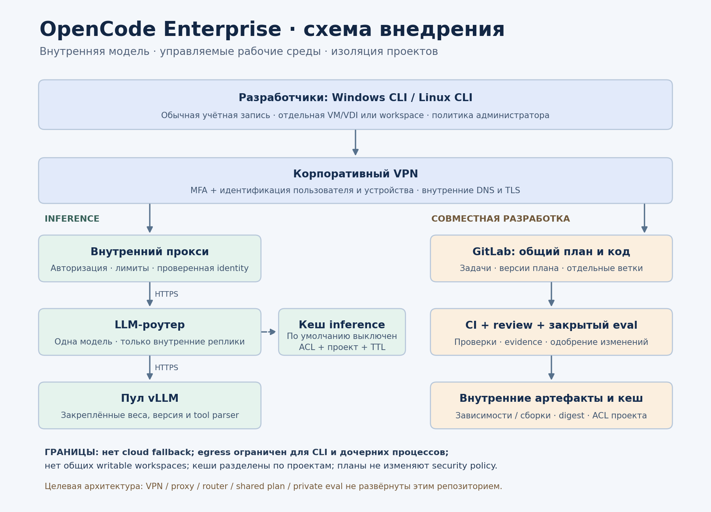
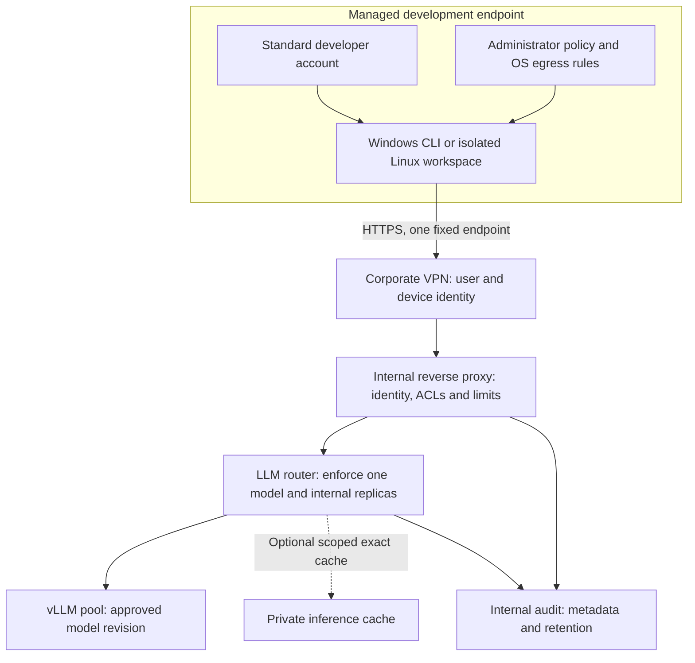
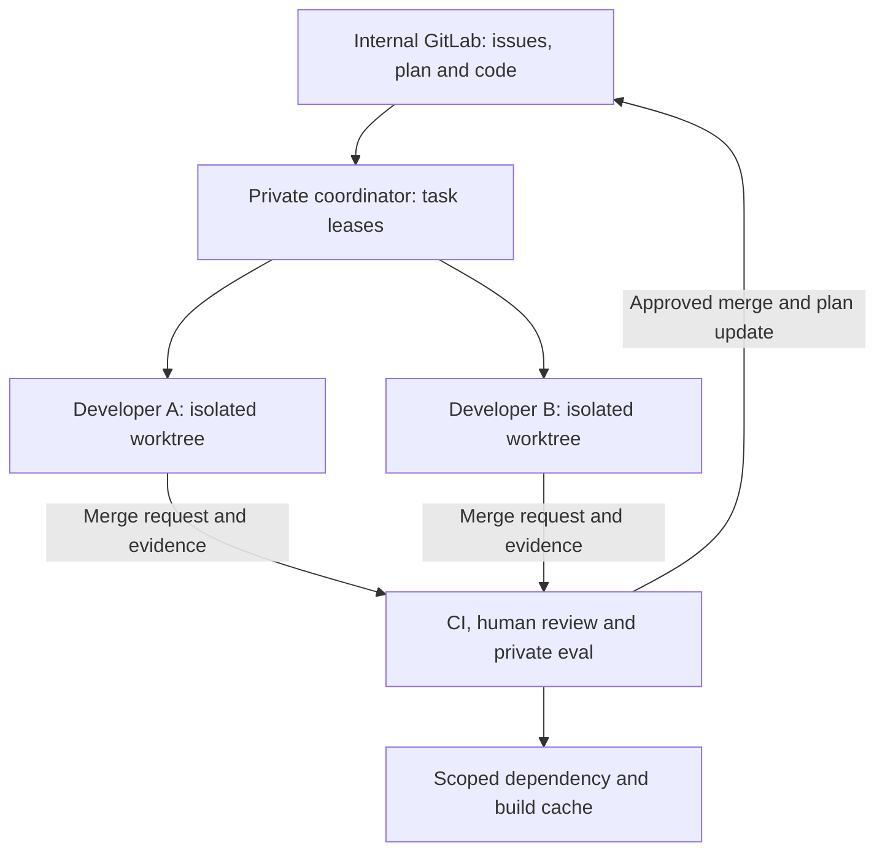

# Enterprise deployment: Windows, VPN, proxy, LLM router and shared state

Reference architecture for a customer-controlled environment, 2026-09-17.
Implemented here: enterprise CLI patches, administrator policy, Linux/Windows CI,
public regressions, installation and acceptance templates. **VPN, identity-aware
proxy, LLM router, shared plan service, cache services and private orchestration
are customer infrastructure / private integration work, not deployed by this repo.**
The existing CLI has one OpenAI-compatible endpoint and does not implement a
shared-planning API, SSO client or a general-purpose model router.

PNG source: `diagrams/render.py` (Matplotlib); regenerate with
`python3 delivery/diagrams/render.py` from the repository root.

## Inference and trust boundaries

- VPN access requires corporate user MFA, device identity and endpoint posture.
  A tunnel provides connectivity; the proxy must still authorize inference.
  Use a trustworthy VPN session-to-user/device binding on a dedicated protected
  network, or a managed identity/mTLS adapter. The current CLI strips bearer,
  cookie and arbitrary routing headers; do not assume it already supports an
  OAuth login or client-certificate configuration. An adapter must be separately
  implemented and tested. Shared NAT source addresses alone are not user identity.
- Proxy is an internal reverse proxy, not an unrestricted HTTP CONNECT service.
  Bind it to the VPN/internal network, strip client-supplied identity/routing
  headers and inject identity only from verified infrastructure. Permit exact
  `POST /v1/chat/completions`; limit body size, request rate and concurrent streams.
  Do not expose admin, metrics, model-management or cache interfaces to developers.
- Router derives tenant/project/model authorization from trusted identity and
  server-side policy. Reject another body `model`, route/provider overrides,
  redirects, remote media URLs and cloud fallbacks. Force the approved model
  upstream. Load balancing may choose only internal replicas with the same approved
  model revision, tokenizer, tool parser, prompt template and policy version.
  Different projects may have separate administrator-managed deployments; developers
  do not choose another model in this build.
- TLS stays enabled and hostname-verified through VPN, proxy and router. Provision
  internal CA trust centrally. Do not use `NODE_TLS_REJECT_UNAUTHORIZED=0`.
  Router-to-vLLM access is private and authenticated; developers cannot contact
  vLLM directly. Authenticate before any cache lookup, including cache hits.
- Set proxy/router header, first-token, stream-idle and total deadlines; propagate
  client cancellation all the way to vLLM. Retry only before an observable stream
  starts, with a bounded budget. These server controls do not close the known CLI
  timeout gap; the separate runtime fix and regressions remain required.
- Deny all endpoint/agent-child-process egress by default; allow corporate DNS and
  the exact proxy plus approved GitLab/artifact services. Apply rules at the managed
  VM/network boundary, not only to `opencode.exe`: an approved shell can launch
  another executable. Router/vLLM also have no Internet route. Build dependencies
  and model weights come from reviewed internal mirrors.

## Shared development plan and orchestration

The shared plan is versioned data in internal GitLab, e.g. `planning/plan.yaml`,
linked to issues and merge requests. It is not a shared writable checkout or an
executable prompt with authority over system policy. Use one worktree/branch and
one filesystem identity per developer/task. Separate customer and project repos;
never place customer plans, prompts, code, logs or credentials in the public fork.

Minimum task fields: `id`, `project`, `base_commit`, `owner`, `status`, `depends_on`,
`acceptance_checks`, `merge_request`, `lease_expires_at`, `evidence_refs`.
Compare-and-swap the plan revision when claiming or completing tasks; expired
leases require revalidation before reassignment. Conflicts go to review. Only
trusted maintainers/coordinator may assign ownership or approve completion.
Untrusted plan text cannot change model, network, tool or approval policy.

Current MVP workflow: humans maintain issues/plan and hand the chosen task to the
CLI, which uses ordinary approved Git operations. Automatic leasing, multi-agent
scheduling, evidence ingestion and private eval execution are **not implemented**
here. Keep that orchestration in the private GitLab repo, consuming signed/pinned
public builds. Common fixes and synthetic regressions originate in public PRs;
private deployment overlays consume them by immutable commit, avoiding backports
from a duplicated private source fork.

## Cache scopes

| Cache | Sharing and key | Required controls |
|---|---|---|
| Dependencies and build outputs | Project/trust tier + lockfile digest + OS/arch + toolchain + patch/source identity | Approved mirrors; immutable digests; only trusted CI writes promoted entries; untrusted MR jobs use separate namespaces |
| Inference exact-response cache | Off by default; tenant + project + principal/ACL scope + model revision + prompt/tool schema + sampling + policy version + full request hash | Authenticate/authorize on every hit; encrypt; bounded TTL; audited invalidation; avoid caching sensitive prompts or tool results; never reuse side effects or approvals |
| vLLM prefix/KV cache | Private to an authorized serving pool; cross-tenant reuse disabled unless the chosen backend proves an isolation control | Backend-specific verification and memory lifecycle tests; separate pools when namespaces/isolation cannot be enforced |
| Plans and source snapshots | Git commit/plan revision, project ACL | GitLab is the source of truth; no global mutable shared agent memory; invalidate stale task snapshots |

Do not enable semantic response caching for coding actions in the MVP. A similar
prompt is not the same repository state or permission decision. Never put tokens,
raw prompts, private eval answers or user-home directories into public Actions
caches/artifacts. Cache failures should bypass to the same approved internal model,
not to a cloud provider. If authorization fails, deny; do not serve stale content.

## Delivery and acceptance

1. Platform team provisions VPN, identity binding, internal DNS/CA, proxy/router,
   isolated workspaces, GitLab, artifact mirrors, quotas and deny-by-default network
   policy. Establish policy/model/cache version ownership and rollback procedures.
2. Security approves an immutable binary/source/patch manifest and signed delivery.
   Endpoint management installs the binary and administrator policy. Developers
   receive standard accounts scoped to their project; no local admin or shared keys.
3. Validate Windows and Linux separately: actual inference, TUI/PTY, tool calls,
   cancellation, denied commands, subagents and local credential exposure. Close the
   known timeout and approval-precedence findings before production acceptance.
4. Negative tests: forged identity headers, VPN disconnect, direct router/vLLM
   access, cloud model names, header/body route overrides, remote media, proxy
   redirect, TLS errors, DNS changes and shell-based Internet requests all fail closed.
5. Shared-state tests: two workers claim the same task, expired lease, stale plan,
   cross-project Git/cache access, revoked identity hitting a warm cache and cache
   poisoning from an untrusted MR. No cross-project response or unauthorized merge.
6. Test gateway outage and zero-chunk streams, restart/cancellation cleanup,
   bounded retry budgets and rollback of the exact approved binary/policy/model.
   Collect signed private acceptance evidence without publishing private cases.

Audit metadata should correlate user/device, project/task, source commit,
policy/model/cache version, approval/denial, request ID and outcome. Do not log
source code or prompt bodies by default. Define TTL, access reviews, incident
revocation and cache purge. This architecture is not a certification or a claim
that private evaluation can guarantee absence of vulnerabilities.
